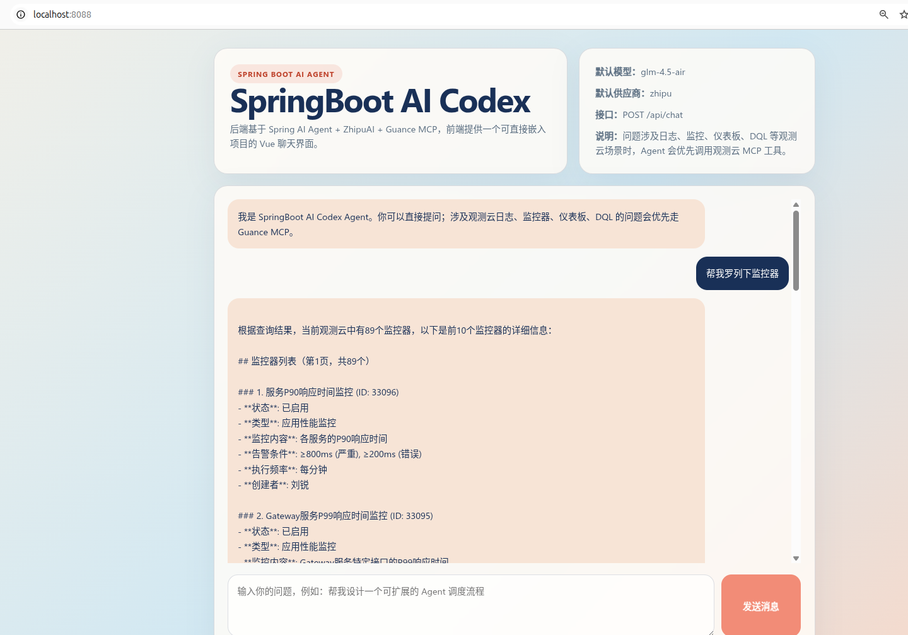
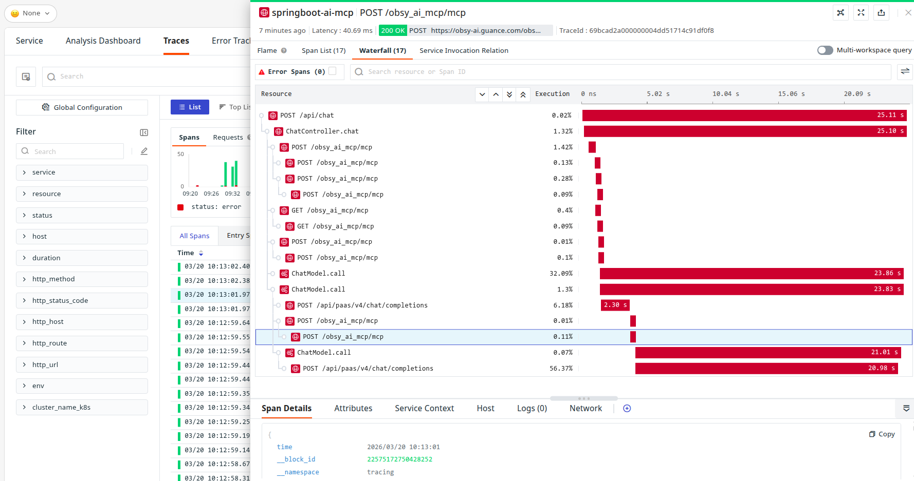
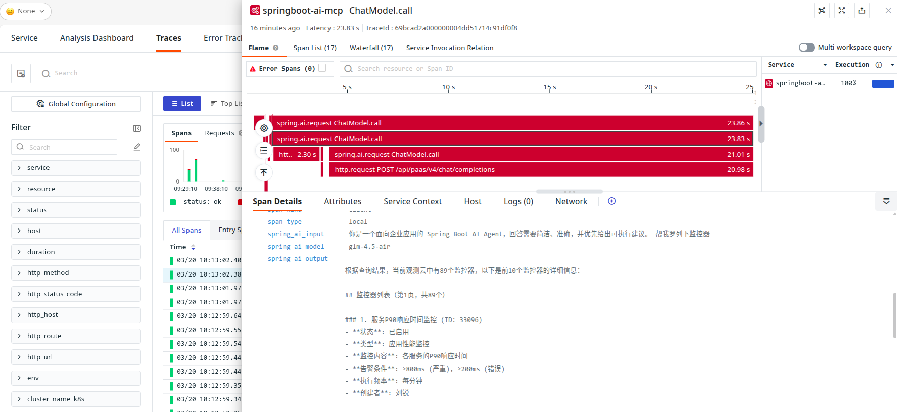

# springboot-ai-mcp

一个基于 Spring Boot 3 + Spring AI + Guance MCP + Vue 3 的 AI Agent 演示项目。

项目采用「前端轻交互 + 后端 Agent 编排 + 外部工具增强」模式：

`Vue 页面 -> /api/chat -> AgentService 路由 -> 纯模型回答 或 MCP 工具增强回答 -> ChatResponse`

## 功能

- 提供 `POST /api/chat` 聊天接口
- `Controller -> AgentService` 分层，Agent 使用 Spring AI ChatClient 驱动模型对话
- 通过 `McpSyncClient` 接入观测云 MCP Server
- 对观测云相关问题，模型可自动调用 MCP 工具获取监控、日志、仪表板等真实数据
- Vue 页面内嵌在 `Spring Boot` 的 `static/` 目录，可直接访问

## 架构实践建议

1. 保持 `Controller -> Service` 分层，Controller 只做参数校验与转发，业务逻辑集中在 Service。
2. 为会话增加服务端兜底的 `conversationId`（项目已实现），保证多轮上下文可追踪。
3. 将模型、提示词、MCP 地址等全部配置化，避免业务代码里出现硬编码。
4. 密钥使用环境变量注入，不在 `application.yml` 明文保存。
5. 统一返回结构（`conversationId/provider/model/reply`）便于前端和日志链路对齐。

## 启动

```bash
cd <project-dir>
mvn spring-boot:run
```

浏览器打开 `http://localhost:8088`



## 接口示例

```bash
curl -X POST http://localhost:8088/api/chat \
  -H 'Content-Type: application/json' \
  -d '{
    "message": "帮我总结这个项目的设计思路",
    "conversationId": ""
  }'
```

## 配置

`src/main/resources/application.yml`

- `app.ai.provider`: 默认 `zhipu`
- `app.ai.model`: 默认 `glm-4.5-air`
- `app.ai.system-prompt`: Agent 系统提示词
- `spring.ai.zhipuai.api-key`: 智谱 API Key
- `spring.ai.zhipuai.chat.options.model`: 智谱模型
- `app.ai.guance.base-url`: 观测云 MCP 服务地址
- `app.ai.guance.endpoint`: MCP endpoint
- `app.ai.guance.api-key`: 观测云 API Key
- `app.ai.guance.site-key`: 站点标识，杭州区为 `cn1`


## 3. 接入 DDTrace APM 链路

### 项目现状

项目已具备 DDTrace 接入基础：

1. Run 配置中已通过 `-javaagent` 注入 `dd-java-agent`。
2. 日志格式中已输出：
    - `%X{dd.service}`
    - `%X{dd.trace_id}`
    - `%X{dd.span_id}`
3. 运行日志可见 Datadog 对 Netty 客户端链路的 instrumentation 栈信息。

### 推荐接入步骤

1. 启动参数注入 Java Agent（示例）：

```bash
-javaagent:/path/to/dd-java-agent.jar
-Ddd.service=springboot-ai-mcp
-Ddd.env=dev
-Ddd.version=0.0.1
-Ddd.trace.agent.port=9529
```

2. 应用日志保留 trace/span 字段，打通 APM 与日志检索。
3. 通过一次真实请求验证：
    - 调用 `POST /api/chat`
    - 日志出现 `dd.trace_id/dd.span_id`
    - APM 中可看到 `Controller -> AgentService -> WebClient(MCP)` 调用链

4. 效果



在链路上可以看到 模型的 input 和 output
